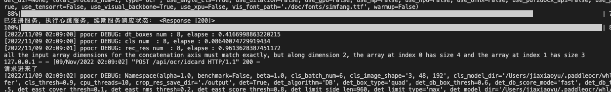

## 使用方法

### 一、安装依赖

```sh
pip3 install -i https://pypi.tuna.tsinghua.edu.cn/simple paddleocr
pip3 install -i https://pypi.tuna.tsinghua.edu.cn/simple paddlepaddle
```
### 二、运行

```sh
python App.py
```

```sh
conda activate paddle_env
sh startup.sh
```

停止

```sh
sh shutdown.sh
```


### 三、接口

#### 1、识别身份证

**描述：**自动识别身份证正反面文本并返回识别结果

**请求类型：**POST

**请求路径：**`/api/ocr/idcard`

**请求参数：**

| 名称       | 类型   | 是否必选 | 描述         |
| ---------- | ------ | -------- | ------------ |
| image_file | file   | 否       | 图片文件     |
| image_url  | 字符串 | 否       | 图片网络路径 |

image_file与image_url两者必须填写一个。

**示例：**

**POST** http://localhost:9000/api/ocr/idcard

**Body:**

Body 类型 : application/json

```json
{
  "image_url":"http://qiniu.yuencode.cn/idCard2/2022/10/11/07d636f14fd4437ab5418183369519bb.jpg"
}
```

**Response：**

```json
{
    "code": 200,
    "data": {
        "addr": "北京紫禁城想住哪就住哪",
        "birth": "1611年2月6日",
        "gender": "男",
        "idcard": "110101161102060468",
        "name": "朱由检",
        "nation": "汉"
    },
    "message": "success"
}
```

**POST** http://localhost:9000/api/ocr/idcard

**Body:**

Body 类型 : multipart/form-data

| NAME       | VALUE  |
| :--------- | :----- |
| image_file | 二进制 |

**Response：**

```json
{
    "code": 200,
    "data": {
        "expTime": "2035-11-03",
        "regTime": "2015-11-03"
    },
    "message": "success"
}
```

### 四、注册nacos

配置字段：

```python
# 是否注册Nacso
nacosOpne = True
# Nacos服务器地址
serviceAddress = "172.16.16.200:8849"
# Nacos注册服务名
serviceName = 'idcardOcrService'
# Nacos注册服务ip
serviceIp = '127.0.0.1'
# Nacos注册服务端口
servicePort = 9000
```

参考：https://www.pudn.com/news/6306ec3cf8728f1f6c82d5b4.html

### 五、其它

身份证图片识别结果存放在./result目录中，注意定期删除


生成requirements.txt命令
```sh
pipreqs . --encoding=utf8 --force
```


当上传这张图片时会出现异常，上传其它图片都没问题。

```json
{
    "code": 500,
    "data": {},
    "message": "all the input array dimensions for the concatenation axis must match exactly, but along dimension 2, the array at index 0 has size 4 and the array at index 1 has size 3"
}
```




产生过很多怀疑，尝试了大概两个小时，找出问题是少写了`convert('RGB')`,如上图所见，第二张我把它截图后再尝试也是不行的，不知道是触发了什么。

```python
image = Image.open(BytesIOObj)
# 更改后 原因竟然是没有添加.convert('RGB') 但就这一张图片不行就奇怪了。
image = Image.open(BytesIOObj).convert('RGB')
```

## 报错处理

module 'numpy' has no attribute 'int'.\n`np.int` was a deprecated alias for the builtin `int`. To avoid this error in existing code, use `int` by itself. Doing this will not modify any behavior and is safe. When replacing `np.int`, you may wish to use e.g. `np.int64` or `np.int32` to specify the precision. If you wish to review your current use, check the release note link for additional information.\nThe aliases was originally deprecated in NumPy 1.20; for more details and guidance see the original release note at:\n    https://numpy.org/devdocs/release/1.20.0-notes.html#deprecations"


```sh
pip uninstall numpy
pip install numpy==1.23.5 -i https://mirror.baidu.com/pypi/simple
```
