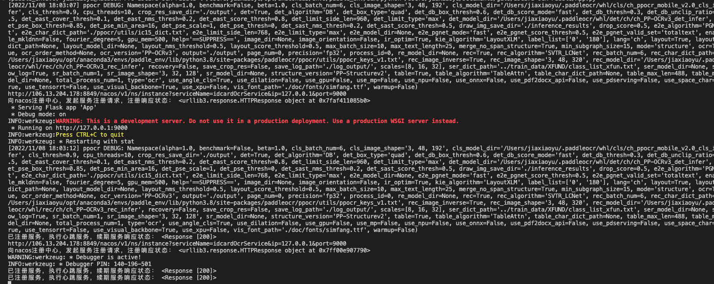
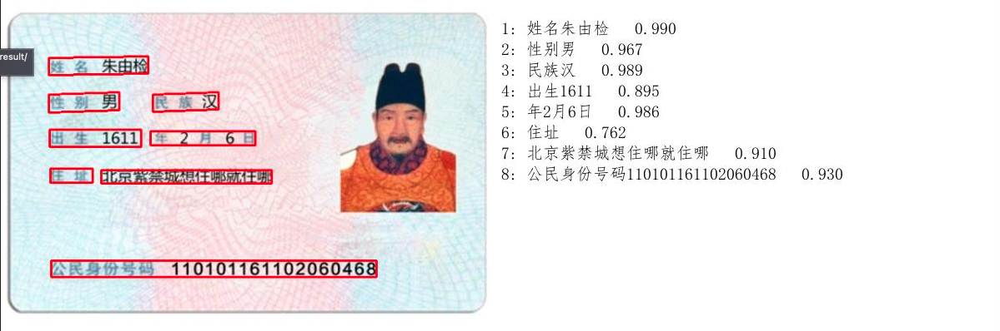
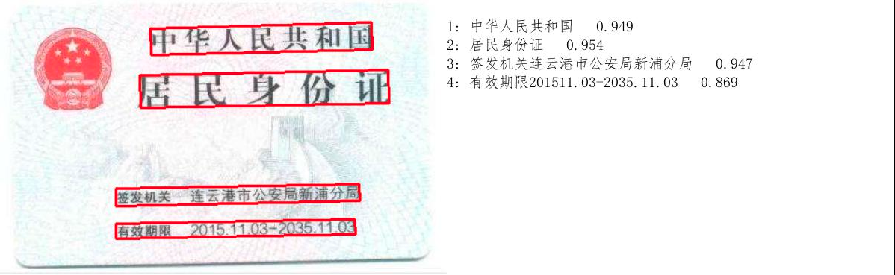

## 使用方法

### 一、安装依赖

```sh
pip3 install -i https://pypi.tuna.tsinghua.edu.cn/simple paddleocr
pip3 install -i https://pypi.tuna.tsinghua.edu.cn/simple paddlepaddle
```
### 二、运行

```sh
python App.py
```



### 三、接口

#### 1、识别身份证

**描述：**自动识别身份证正反面文本并返回识别结果

**请求类型：**POST

**请求路径：**`/api/ocr/idcard`

**请求参数：**

| 名称       | 类型   | 是否必选 | 描述         |
| ---------- | ------ | -------- | ------------ |
| image_file | file   | 否       | 图片文件     |
| image_url  | 字符串 | 否       | 图片网络路径 |

image_file与image_url两者必须填写一个。

**示例：**

**POST** http://localhost:9000/api/ocr/idcard

**Body:**

Body 类型 : application/json

```json
{
  "image_url":"http://qiniu.yuencode.cn/idCard2/2022/10/11/07d636f14fd4437ab5418183369519bb.jpg"
}
```

**Response：**

```json
{
    "code": 200,
    "data": {
        "addr": "北京紫禁城想住哪就住哪",
        "birth": "1611年2月6日",
        "gender": "男",
        "idcard": "110101161102060468",
        "name": "朱由检",
        "nation": "汉"
    },
    "message": "success"
}
```

**POST** http://localhost:9000/api/ocr/idcard

**Body:**

Body 类型 : multipart/form-data

| NAME       | VALUE  |
| :--------- | :----- |
| image_file | 二进制 |

**Response：**

```json
{
    "code": 200,
    "data": {
        "expTime": "2035-11-03",
        "regTime": "2015-11-03"
    },
    "message": "success"
}
```

### 四、注册nacos

配置字段：

```python
# 是否注册Nacso
nacosOpne = True
# Nacos服务器地址
serviceAddress = "172.16.16.200:8849"
# Nacos注册服务名
serviceName = 'idcardOcrService'
# Nacos注册服务ip
serviceIp = '127.0.0.1'
# Nacos注册服务端口
servicePort = 9000
```


### 五、其它

身份证图片识别结果存放在./result目录中，注意定期删除





生成requirements.txt命令
```sh
pipreqs . --encoding=utf8 --force
```